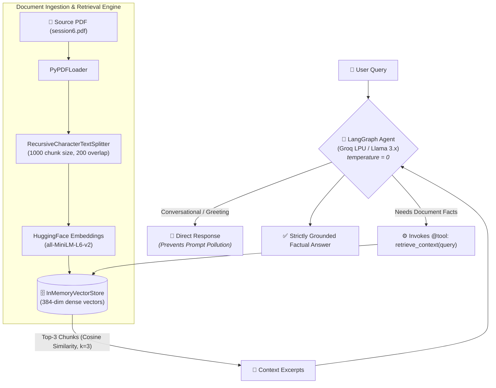

# Grounded Document Assistant (Agentic RAG)

An enterprise-ready, Agentic Retrieval-Augmented Generation (RAG) system built with LangGraph, LangChain, Groq LPU inference, and HuggingFace semantic embeddings.

---

## Overview

Off-the-shelf Large Language Models suffer from knowledge cutoffs and probabilistic hallucinations when queried on domain-specific or proprietary enterprise documentation.

This project implements an **Agentic RAG architecture** using the ReAct (Reasoning + Acting) pattern. Rather than blindly executing vector lookups on every interaction, the system evaluates user intent, invokes retrieval tools conditionally, grounds responses strictly within document context, and prevents hallucinations on out-of-domain queries by enforcing a zero-temperature decoding strategy.

---

## System Architecture & Flow


---

## Key Features

* **Agentic Tool Orchestration:** Implements LangGraph's `create_react_agent` to enable dynamic tool calling. The retrieval engine is exposed as an autonomous `@tool`, preventing prompt pollution on non-retrieval inputs.
* **Context Preservation:** Documents are parsed via `RecursiveCharacterTextSplitter` configured with a 1,000-character chunk size and a 200-character sliding overlap to prevent boundary clipping of cross-sentence reasoning.
* **Low-Latency Inference:** Powered by Groq's Language Processing Unit (LPU) architecture, delivering sub-second token generation and fast tool invocation loops.
* **Multi-Turn State Retention:** Integrates `InMemorySaver` checkpointers to manage thread-safe dialogue state across multi-turn interactions.
* **Zero-Hallucination Guardrails:** Restrictive system instructions combined with greedy decoding (`temperature=0`) guarantee that out-of-context queries trigger graceful fallbacks rather than confabulated answers.

---

## Tech Stack

* **Orchestration:** LangChain, LangGraph
* **LLM Engine:** Groq Cloud API (LPU Inference)
* **Embedding Model:** HuggingFace `sentence-transformers/all-MiniLM-L6-v2` (384-dim)
* **Document Parsing:** PyPDF (`PyPDFLoader`)
* **Vector Storage:** LangChain `InMemoryVectorStore`
* **Configuration:** `python-dotenv`

---

## Repository Structure

| File / Folder | Role in System |
| :--- | :--- |
| `rag_agent.py` | Main script containing the PDF loader, chunking, vector indexing, `@tool` definition, and LangGraph agent. |
| `session6.pdf` | Sample enterprise source document used for ingestion and grounding. |
| `.env.example` | Template demonstrating how to define the `GROQ_API_KEY` environment variable. |
| `.env` | Local environment file storing your private API key *(git-ignored)*. |
| `requirements.txt` | Pinned dependencies (`langgraph`, `langchain-groq`, `sentence-transformers`, `pypdf`, etc.). |
| `.gitignore` | Prevents `.env` API keys, virtual environments, and large PDFs from leaking into version control. |
| `LICENSE` | Standard open-source MIT License terms. |
| `README.md` | Architectural documentation, test prompts, and setup guide. |


---

## Getting Started

### 1. Prerequisites
* Python 3.10+
* A valid Groq Cloud API Key ([Get an API Key](https://console.groq.com/))

### 2. Installation & Setup

Clone the repository and set up an isolated environment:
```bash
git clone [https://github.com/your-username/document-rag-agent.git](https://github.com/your-username/document-rag-agent.git)
cd document-rag-agent
python -m venv .venv
source .venv/bin/activate  # On Windows: .venv\Scripts\activate
```
Install requirements:

```bash
pip install -r requirements.txt
```

Contents of requirements.txt:
```Plaintext
langchain>=0.2.0
langgraph>=0.1.0
langchain-groq>=0.1.0
langchain-community>=0.2.0
langchain-huggingface>=0.0.3
sentence-transformers>=2.6.0
pypdf>=4.0.0
python-dotenv>=1.0.0
```

### 3. Environment Configuration
Create a .env file in the project root:

```bash
cp .env.example .env
```
Populate your key inside .env:

```Ini, TOML
GROQ_API_KEY=gsk_your_groq_api_key_here
```

### 4. Running the Assistant
Place your target PDF in the working directory (e.g., session6.pdf) and execute:

```bash
python rag_agent.py
```

## Sample Execution Scenarios
### In-Domain Extraction (Working Capital Metric)
```Plaintext
User: What is the formula for Working Capital?
Assistant: Based on the provided document, the metric is expressed in days:
Working Capital Days = Inventory Days + Receivable Days - Payable Days
```
### Out-of-Domain Safety Check (Zero Hallucination)
```Plaintext
User: What is photosynthesis?
Assistant: The provided document does not contain information regarding photosynthesis.
```

## Production Scalability Roadmap
- Persistent Vector Database: Transition from InMemoryVectorStore to distributed engines (e.g., Qdrant, Milvus, or pgvector) for scaling to thousands of enterprise PDFs.

- Hybrid Search Integration: Combine dense vector search with sparse BM25 retrieval via Reciprocal Rank Fusion (RRF) to index exact alphanumeric codes, serial numbers, and part identifiers accurately.

- Document Structure Ingestion: Integrate layout-aware extractors (Unstructured or Markdown table splitters) to preserve complex row-column headers.
